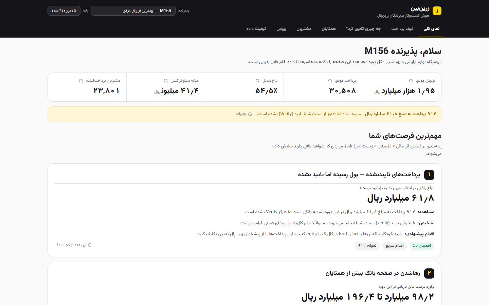
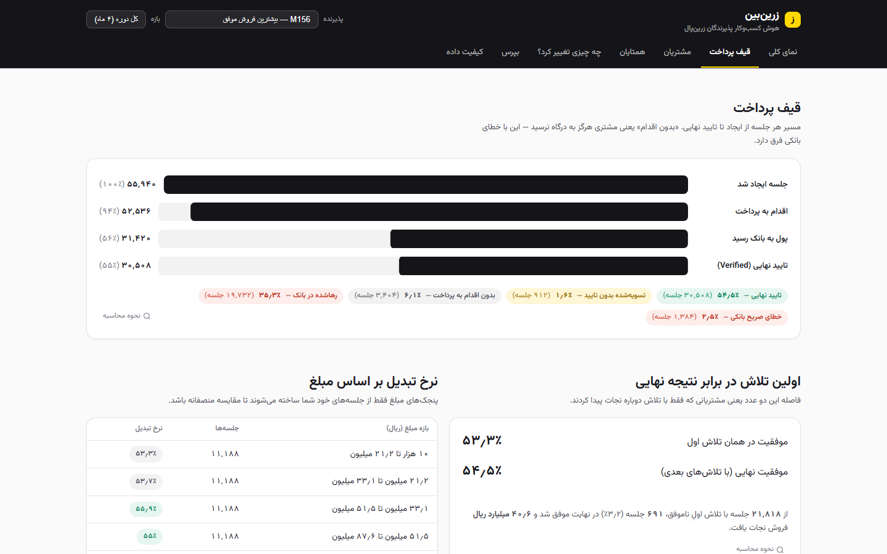
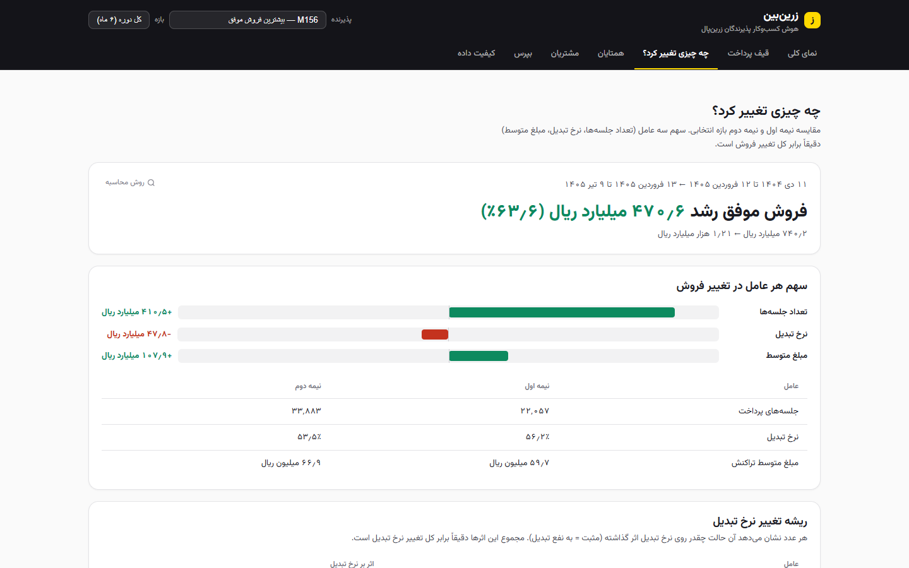
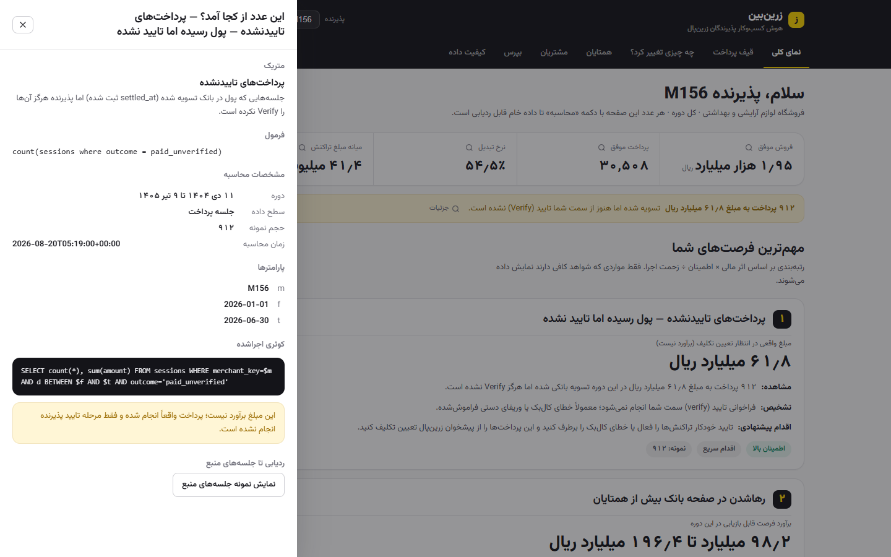
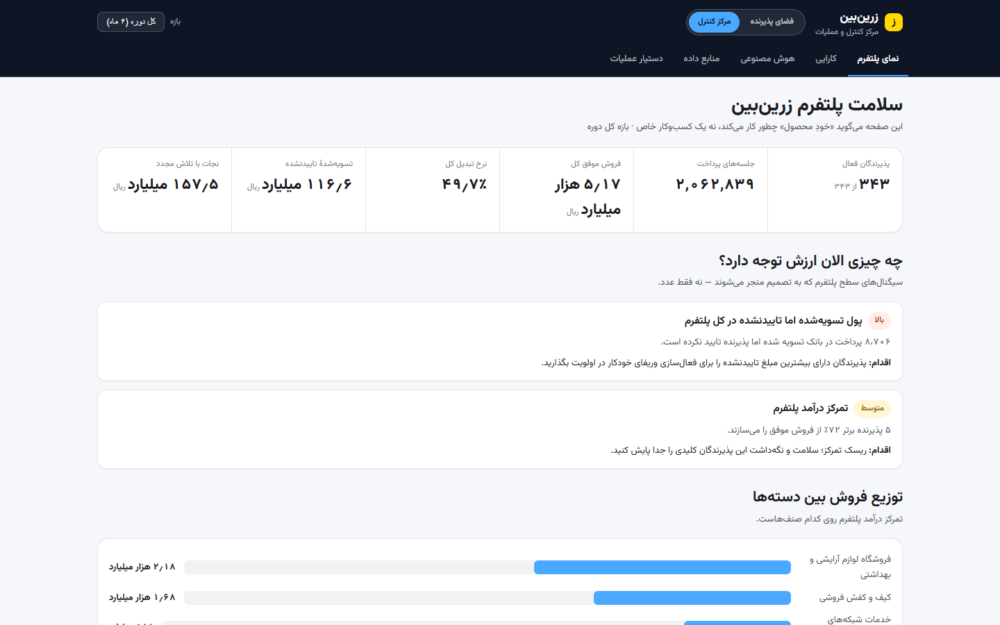
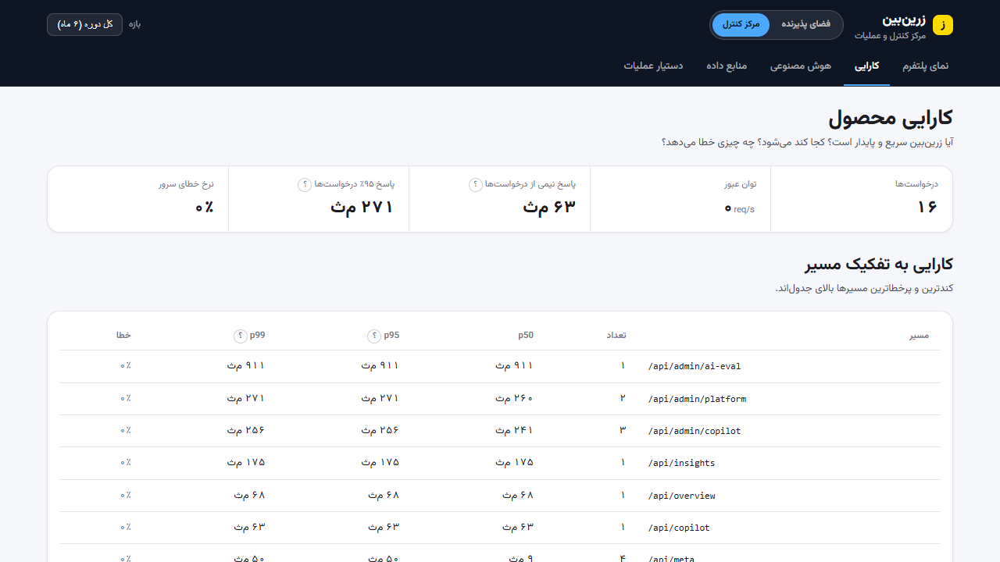
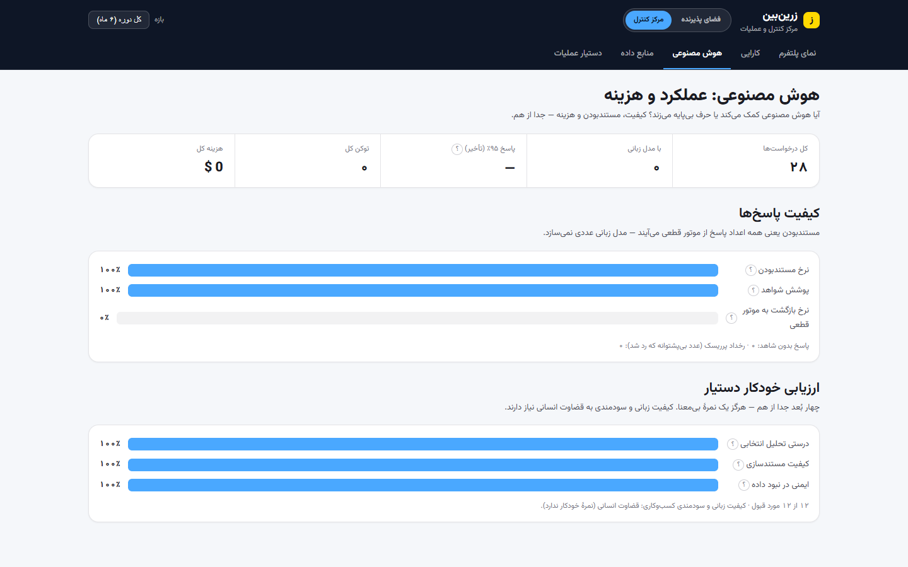
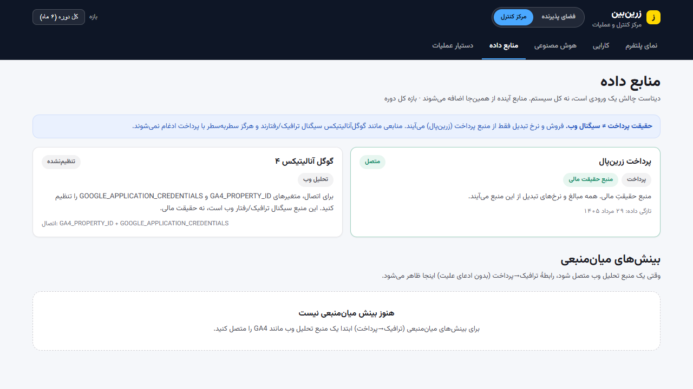

# Zarbin · زرین‌بین
### Merchant Intelligence **+** AI Operations for ZarinPal

Zarbin turns a ZarinPal payments dataset into **decisions**, across two connected surfaces that
share one deterministic intelligence platform:

- 🧑‍💼 **Merchant Workspace** — an insight-first dashboard that answers *"what's happening in my
  business, why, and what should I do?"* — no analytics knowledge required.
- 🛠️ **Control Center** — an operations surface (business / product / data / AI / engineering)
  that answers *"how is Zarbin itself doing?"* — platform health, product performance, AI
  operations & cost, data sources.

> The merchant sees a simple product. Underneath it is sophisticated — and every number is
> deterministic, traceable, and never invented by an AI.

---

## ▶ Open the product

```bash
uv run zarin
```
Then open **🔗 http://localhost:8630**

- **Merchant Workspace** → `http://localhost:8630/#/overview` (best first merchant: **M156**)
- **Control Center** → `http://localhost:8630/#/ops/overview`
  (or click **«مرکز کنترل»** in the top-right switch)

First run builds the Parquet marts (~33s), then serves. Windows/OneDrive: set `UV_LINK_MODE=copy`
(the `scripts/run.*` launchers and the VS Code task *"Run Zarbin Dashboard"* do this for you).
No API key and no network are required — the product runs fully offline on the deterministic engine.

---

## The major innovations

| | |
|---|---|
| **Paid-but-Unverified** | Money that settled at the bank but the merchant never verified — **real settled money, not an estimate.** Surfaced and quantified, not buried. |
| **Payment Rescue** | Sessions whose first attempt failed but a retry succeeded — recovered GMV, measured. |
| **Opportunity Engine** | Opportunity = **counterfactual** (gap vs matched peers × sessions × own conversion × own ticket, capped at realized GMV). **Never** "lost revenue = Σ failed amounts." |
| **Explainable peers** | Peers matched by category + scale band + ticket band, ≥ pool size, suppressed when thin — with the *reason* shown. |
| **What Changed?** | Exact decomposition of a GMV move into sessions × conversion × ticket (LMDI, sums exactly). |
| **Evidence lineage** | Every number has a «محاسبه» button → definition, method, the **SQL that ran**, params, sample size, caveats, drill-through to source rows. |
| **Grounded Copilot** | Deterministic answers; an optional LLM only *rephrases*. A grounding guard rejects any invented number. Works offline. |
| **AI Operations** | Live AI quality separated into deterministic / grounding / language / usefulness — plus fallback, hallucination-risk, latency, tokens, **cost**. |
| **Voice** | Persian voice-to-text on both copilots (Web Speech, graceful fallback). |
| **Pluggable sources** | `DataSourceAdapter` — GA4 first (config-gated); web signals never confused with payment truth. |

---

## Architecture

```
             ┌──────────────────────────  one shared semantic layer  ──────────────────────────┐
 dataset ─►  DuckDB / Parquet marts ─► analytics · insights · peers ─► metric registry (evidence)
             (pipeline.py, db.py)              │                               │
                                               ├─► copilot.py (merchant) ─┐    │
 telemetry ◄─ obs.py (requests)                └─► ops_copilot.py (ops) ──┤    │
 telemetry ◄─ ai/telemetry.py (AI)                                         ▼    ▼
 sources/ (DataSourceAdapter: zarinpal=truth, ga4=gated)      ai/gateway.py (grounding guard)
                                                                    │  ▲ evidence-safe context
 control.py ─ platform · performance · ai-ops · sources             ▼  │ free-model policy
             ─────────────────  FastAPI: /api/* + /api/admin/*  ──►  [optional] OpenRouter (:free only)
                                        │
                          React + Vite + TS (RTL) ── Merchant surface  +  Control Center surface
```
Full rationale in **[docs/ADR/](docs/ADR/)** and **[docs/PLATFORM_BOOK.md](docs/PLATFORM_BOOK.md)**.

### Stack — kept, deliberately
Python · FastAPI · **DuckDB** / Parquet · React · Vite · TypeScript. We evaluated Next.js /
Postgres / ClickHouse / Redis / queues and **kept the stack**: it gives analytical correctness
(in-process columnar OLAP), one-command local reproducibility (no services, no keys), and clean
seams that isolate exactly what a production migration would swap. The multi-tenant migration path
(object storage → Postgres → ClickHouse → queues → OTel → OIDC/RBAC) is documented, not prematurely
built. See **[ADR-0001](docs/ADR/0001-architecture-stack.md)**.

---

## Preview

**Merchant Workspace**

| Overview | Funnel | What Changed? | Evidence drawer |
|---|---|---|---|
|  |  |  |  |

**Control Center**

| Platform | Product performance | AI operations | Data sources |
|---|---|---|---|
|  |  |  |  |

---

## Quick start

```bash
git clone https://github.com/ladekarl1234-commits/zarbin-merchant-intelligence.git
cd zarbin-merchant-intelligence
uv run zarin                     # builds marts on first run, serves http://localhost:8630
```
Rebuild the frontend: `cd frontend && npm ci && npm run build` (outputs to `zarin/static`).
Docker: `docker compose up`.

### 60-second demo path
1. **Overview (M156)** — top opportunity is **Paid-but-Unverified** (real settled money) with an evidence drawer.
2. **What Changed?** — decompose a GMV move into traffic × conversion × ticket.
3. **Ask** — "چرا فروشم کم شد؟" · try the 🎙️ mic.
4. Switch to **مرکز کنترل** → **AI operations**: grounded rate, fallback, cost (₴0, free-model policy).
5. **Data sources** — ZarinPal = truth; GA4 = ready-to-connect.

---

## Environment variables
`OPENROUTER_API_KEY` (optional; enables LLM rephrasing) · `OPENROUTER_MODEL`
(default `deepseek/deepseek-chat-v3-0324:free`, **free-model policy enforced**) ·
`GA4_PROPERTY_ID` + `GOOGLE_APPLICATION_CREDENTIALS` (optional GA4) ·
`ZARIN_ADMIN_TOKEN` (set → Control Center API requires `X-Admin-Token`) ·
`ZARIN_PORT` (8630) · `ZARIN_HOST` · `ZARIN_DATA_PATH` · `ZARIN_MARTS_DIR` · `ZARIN_TELEMETRY_DIR`.
No secrets are committed; the dataset is git-ignored and absent from history.

## Testing
```bash
uv run pytest -q                 # 56 tests
uv run ruff check .              # lint
cd frontend && npm run build     # tsc (strict) + vite
uv run python -m zarin.ai.eval   # copilot eval: deterministic / grounding / refusal
```
CI: [.github/workflows/ci.yml](.github/workflows/ci.yml) (Python + frontend jobs).

---

## Independent expert review

This repository carries its own audit. Commit `75de6bb` was evaluated by a panel of **15 specialized
expert agents** — architecture, code quality, data & analytics correctness, statistical methodology,
security, reliability, scalability, product, business viability, UX, design, accessibility, AI
grounding, testing, plus a lens scoring the competition's own 300-point rubric. Every **critical** and
**high** finding was then re-examined by a **separate verification agent** before being recorded
(43/43 confirmed, 0 refuted). 58 agents ran in total.

| | |
|---|---|
| Mean dimension score | **73.4 / 100** (median 73, range 61–82) |
| Competition rubric | **236 / 300** (actionability 76/90 · correctness 58/75 · depth 41/60 · UX 36/45 · technical 25/30) |
| Findings documented | **119** — 5 critical · 39 high · 56 medium · 19 low |
| Strongest dimensions | code quality **82** · data correctness **82** · architecture **80** |
| Weakest dimensions | accessibility **61** · security **66** · scalability **66** |

The headline result is a **claim-vs-enforcement gap**: the analytical core is genuinely strong (grain
discipline verified live, LMDI exact to ~1e-15, acyclic layering, deterministic-first AI), but several
guarantees are stated unconditionally in the docs while being only partly enforced in code — the
realized-GMV cap covers one of four opportunity generators, the evidence drawer prints a formula the
code no longer uses, and the "the LLM may only rephrase" guard inspects digits only. Those, plus the
absence of authentication and the accessibility conformance gaps, are the work queue.

- 📋 **[docs/EXPERT_REVIEW.md](docs/EXPERT_REVIEW.md)** — the record: method, panel, scores, rubric
  mapping, per-lens verdicts, priority queue, final assessment and the review's own limitations.
- 🐞 **[docs/EXPERT_REVIEW_ISSUES.md](docs/EXPERT_REVIEW_ISSUES.md)** — all 119 findings, each with a
  stable ID (`ZB-001`…`ZB-119`), location, observed evidence, impact, recommended fix and effort.
- 🧾 **[docs/expert_review_findings.json](docs/expert_review_findings.json)** — the raw structured
  results, machine-readable (regenerate the documents with `pipeline/gen_expert_review.py`).

*(Excluded from that round by request: the demo video and deployment/hosting/CI-CD — it evaluates the
software itself, so it is not a production-readiness verdict.)*

## Documentation
- **[memory.md](memory.md)** — engineering continuity: invariants, AI rules, gotchas.
- **[docs/PLATFORM_BOOK.md](docs/PLATFORM_BOOK.md)** — why this exists and why it's built this way.
- **[docs/ADR/](docs/ADR/)** — stack · deterministic-vs-LLM · OpenRouter free policy · source adapters.
- **[docs/DEPLOYMENT_SPEC.md](docs/DEPLOYMENT_SPEC.md)** — local + production-shaped deployment.
- **[docs/EXPERT_REVIEW.md](docs/EXPERT_REVIEW.md)** — 15-agent expert audit: scores, findings, assessment.
- **[docs/ARCHITECTURE.md](docs/ARCHITECTURE.md)** · **[docs/ANALYTICS.md](docs/ANALYTICS.md)** ·
  **[docs/DATA_AUDIT.md](docs/DATA_AUDIT.md)** · **[docs/DESIGN.md](docs/DESIGN.md)** ·
  **[CONTRIBUTING.md](CONTRIBUTING.md)** · **[docs/JURY_REVIEW.md](docs/JURY_REVIEW.md)** ·
  **[docs/VALIDATION.md](docs/VALIDATION.md)**.

## Limitations (honest)
Opportunity intervals are scenarios, not bootstrap CIs (labelled; low-peer flagged). Telemetry is a
hackathon JSONL store. Single-tenant, no enforced auth (queries already scoped). GA4 live pull and
paid-LLM calls are config-gated. See PLATFORM_BOOK §15 for the full list.

---
*IRR (rial) throughout · Persian-first RTL · ZarinPal brand · deterministic, traceable, grounded.*
